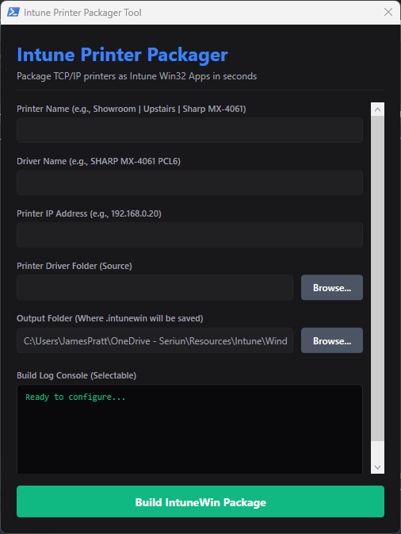
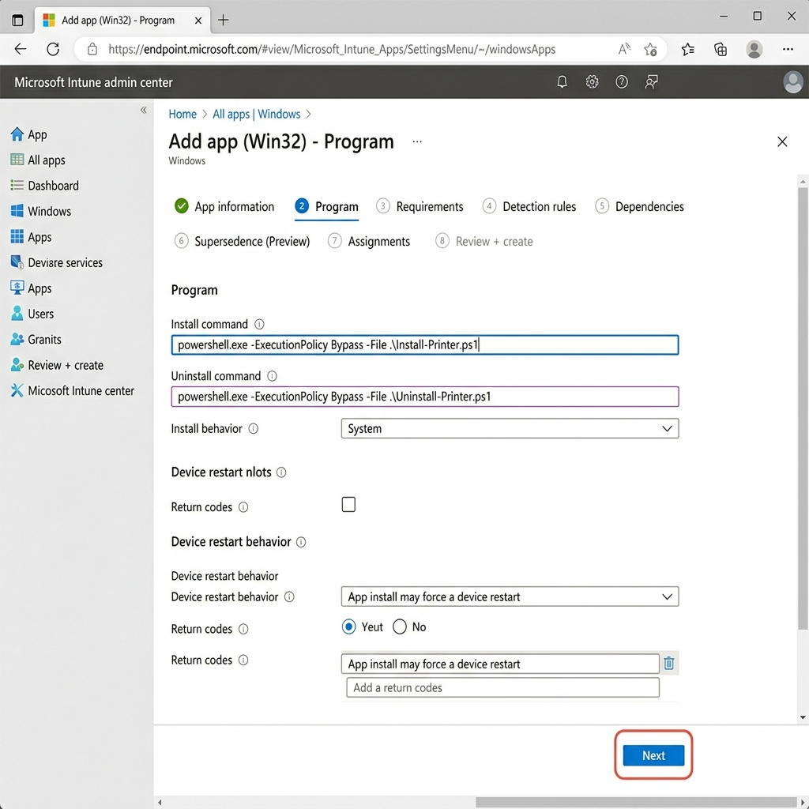

# How-To Guide: Intune Printer Packaging & Deployment


## Overview

The **Intune Printer Packager** is a PowerShell WPF-based graphical interface that prepares, structures, and compiles printer installers and driver binaries into a Microsoft-approved `.intunewin` package.


### Key Features

* **Zero Coding Required**: Staging folder setup, script compilation, and configuration file editing are handled automatically.
* **Fail-Fast Validations**: Pre-verification of printer IP addresses and driver names prevents deployment errors.
* **Automatic Outputs**: Compiles the `.intunewin` app, extracts the `.ps1` custom detection script, and writes a `.txt` configuration summary directly to your output directory.
* **Zero Setup Overhead**: Automatically downloads the official `IntuneWinAppUtil.exe` binary directly from Microsoft's GitHub repository if it is not present in the script directory.
* **Silent PCA Bypass**: Automatically stops and restores the Program Compatibility Assistant service (`PcaSvc`) during installation to prevent legacy driver co-installer prompts (such as Kyocera compatibility warning dialogs) from hanging the silent Intune deployment.


> **Log File Location:** `C:\Logs\AddPrinter\<PrinterName>\Install-Printer.log` (or `$env:SystemDrive\Logs\AddPrinter\<PrinterName>\Install-Printer.log`)

## Prerequisites

OS Support: Windows 10 / 11 or Windows Server.
PowerShell: Windows PowerShell 5.1 or PowerShell Core 7+.
Permissions: Local administrator rights (required to register print drivers and queues).
Execution Policy: Bypass mode permitted to execute local scripts.


## Walkthrough & Usage Guide

### 1. Packaging a Printer Step-by-Step

#### Step 1.0: Extracting Drivers from Executables (if needed)

Many printer drivers are downloaded from the manufacturer's site as self-extracting `.exe` installers instead of raw driver folders. Since the packager tool requires direct access to the `.inf` configuration files, you should not package the `.exe` directly. Instead:

1. Download and install **7-Zip**.
2. Right-click the manufacturer's driver `.exe` file.
3. Select **7-Zip** > **Extract to "FolderName"**.
4. In the packager tool, point the **Printer Driver Folder** to this extracted directory (or its subdirectory containing the `.inf`, `.cat`, and `.sys` files).

#### Step 1.1: Launch the Application

Double-click the **Start-Gui.bat** file in your workspace directory. This automatically launches the dark-themed WPF desktop interface:



#### Step 1.2: Enter Printer Parameters

* **Printer Name**: The name shown in the Windows printer list (e.g. `Prep | Upstairs | Epson WF-C579R`).
* **Driver Name**: The exact name matching your printer model (e.g. `EPSON WF-C579R Series PCL6`). See the **Validation** section below if you are unsure of the exact name.
* **Printer IP Address**: The static IPv4 address of the printer (e.g. `192.168.60.246`).

#### Step 1.3: Select Directories

* **Printer Driver Folder (Source)**: Click **Browse...** and select the folder on your filesystem containing your printer drivers (this directory must contain the `.inf` driver file).
* **Output Folder**: Click **Browse...** to select where the outputs should be compiled (defaults to your script folder).

#### Step 1.4: Build the Package

Click **Build IntuneWin Package**. The tool will validate your inputs, set up a temporary staging workspace, verify the files, call Microsoft's prep tool, and generate the final outputs.


### 2. Built-In Verification Features

To prevent common post-deployment issues (such as the print spooler failing to find the driver store model), the tool runs two pre-verifications before packaging:

#### 2.1 IP Address Validation

The tool checks the **Printer IP Address** input using native `.NET` `[System.Net.IPAddress]::TryParse` logic.
* If you enter a mathematically invalid address (such as `192.168.60.300` or a typo like `256.0.0.1`), the tool halts and warns you immediately.

#### 2.2 Driver Name Mismatch Dialog

If the entered **Driver Name** does not match any printer model strings defined inside the `.inf` files in your driver directory:

1. The tool halts and opens a custom **Driver Name Mismatch** popup window.
2. It lists all the valid printer model name candidates it parsed from the driver `.inf` files.
3. You can select the correct driver name from the list and click **Use Selected** to automatically update the form and resume the build process.

#### 2.3 How to Manually Find the Driver Name in an INF File

If you ever want to check the exact driver name manually inside the driver package:

1. Open the folder containing your extracted driver files.
2. Look for any file ending with the **`.inf`** extension (e.g., `OEMSETUP.inf`, `hpbuio160l.inf`, etc.).
3. Right-click the `.inf` file and select **Open with** > **Notepad**.
4. Scroll down to the very bottom of the file to locate the **`[Strings]`** section.
5. Look for the printer model names list. The exact driver name is the text enclosed in **double quotation marks** on the right side of the equals sign.
   * *Example:* If you see the line:
     ```
     Kyocera_M5526 = "Kyocera ECOSYS M5526cdw KX"
     ```
     Then the exact driver name you should copy/type into the packager tool is: **`Kyocera ECOSYS M5526cdw KX`** (do not include the quotation marks).


### 3. Testing Intune Win32 Packages in Windows Sandbox

To ensure your printer packages install cleanly without modifying your local workstation configuration, it is highly recommended to test them in a clean, isolated virtual machine environment using **Windows Sandbox**.

#### 3.1 Enable Windows Sandbox

* Open the Start Menu, type `Turn Windows features on or off`, and press Enter.
* Scroll down, locate **Windows Sandbox**, check the box, and click **OK**.
* **⚠️ WARNING**: A system restart is required after enabling Windows Sandbox before it can be used.

#### 3.2 Install the "Run in Sandbox" Right-Click Utility

To speed up testing, we recommend installing the "Run in Sandbox" right-click utility (documented at [PowerShell is Fun](https://powershellisfun.com/2023/04/03/using-run-in-sandbox-for-testing-scripts-and-intune-packages/)).
* This tool adds a context menu option directly to `.intunewin` package files, allowing you to launch them inside a clean Sandbox with a single click.

#### 3.3 Running the Sandbox Test

* Right-click your generated `.intunewin` file (e.g., `ShowroomUpstairsSharpMX4061.intunewin`) and select **Run in Sandbox**.
* Windows Sandbox will open a clean desktop, copy your package, and display a blue and white console window prompt.
* In this console window, type the install command to execute your deployment script in the isolated environment:
  ```powershell
  powershell.exe -ExecutionPolicy Bypass -File .\Install-Printer.ps1
  ```
* Wait for the print configuration and driver staging tasks to complete. If the printer is successfully installed inside the Sandbox, your package is ready for Intune deployment!


### 4. Microsoft Intune Deployment Setup

Once packaging completes successfully and you have verified the installer locally, you can deploy the printer globally via Microsoft Intune.

A new folder named after the printer (e.g. `Showroom - Upstairs - Sharp MX-4061`) is created inside your output directory. It contains the following three files:
* `YourPrinterName.intunewin` (The Win32 App package with spaces and special characters removed, e.g. `ShowroomUpstairsSharpMX4061.intunewin`)
* `YourPrinterName_Detection.ps1` (The custom detection script, e.g. `Showroom - Upstairs - Sharp MX-4061_Detection.ps1`)
* `YourPrinterName_Instructions.txt` (Copy-pasteable Intune configuration details, e.g. `Showroom - Upstairs - Sharp MX-4061_Instructions.txt`)

#### Step 4.1: Add Win32 App in Intune

1. Log in to the **Microsoft Intune admin center**.
2. Go to **Apps** > **All apps** > **Add**.
3. Select **Windows app (Win32)** and click **Select**.
4. Upload the compiled `.intunewin` file (e.g., `PrepUpstairsEpsonWFC579R.intunewin`).

#### Step 4.2: Recommended Intune Description & Log Reference

When creating the Win32 Application in the Microsoft Intune admin center, copy and paste the customized configuration description directly from the GUI console log or the generated instructions text file (`_Instructions.txt`) into the **Description** field of the app metadata.

The program automatically compiles this description with your printer's specific details and log locations. Here is an example of what it looks like:

```text
======================================================================
INTUNE WIN32 APP CONFIGURATION & LOG REFERENCE
======================================================================
Printer Name:   Showroom - Downstairs - Kyocera M5526cdw
Driver Name:    Kyocera ECOSYS M5526cdw KX
IP Address:     192.168.1.240
----------------------------------------------------------------------
WORKSTATION LOG DIRECTORY:
C:\Logs\AddPrinter\Showroom - Downstairs - Kyocera M5526cdw\

INSTALLATION LOG:
C:\Logs\AddPrinter\Showroom - Downstairs - Kyocera M5526cdw\Install-Printer.log

UNINSTALLATION LOG:
C:\Logs\AddPrinter\Showroom - Downstairs - Kyocera M5526cdw\Uninstall-Printer.log
======================================================================
```

#### Step 4.3: Program Configuration

In the **Program** configuration step, copy and paste the commands directly from the console log or the instructions text file:



* **Install Command**:
  ```powershell
  powershell.exe -ExecutionPolicy Bypass -File .\Install-Printer.ps1
  ```
* **Uninstall Command**:
  ```powershell
  powershell.exe -ExecutionPolicy Bypass -File .\Uninstall-Printer.ps1
  ```
* **Install Behavior**: **System** (Required to stage drivers into the local Driver Store).

#### Step 4.4: App Detection Rules

In the **Detection rules** step:

1. Set **Rules format** to **Use a custom detection script**.
2. Click the folder icon under **Script file** and upload the **`YourPrinterName_Detection.ps1`** file from your output folder.
3. Set **Run script as 32-bit process on 64-bit clients** to **No**.
4. Leave other values as default and click **Next**.

#### Step 4.5: App Assignments

In the **Assignments** step, you specify who should receive the printer deployment:

> [!IMPORTANT]
> **Always Test with a Small Group First**
> Never assign a new printer deployment directly to **All Devices** or large production groups immediately. Even after verifying in Windows Sandbox, always deploy to a small, controlled **Test Group** (containing pilot users or workstations) first. This ensures you catch any local driver conflicts, print spooler crashes, or registry permission issues before they impact the entire organization.

* **Testing Phase**: Assign the application to a dedicated **Test Group** to verify silent background installation behaviors.
* **Production Release (Going Live)**: Assign the application to a targeted production group or **All Devices** depending on your organization's deployment requirements.
* **Self-Service Option (Recommended)**: A preferred deployment pattern is to add **All Users** to the **Available for enrolled devices** section. This allows users to search for the printer and install it at their convenience through the Microsoft Company Portal app without forcing it automatically on all workstations.


#### 5. Critical Network Reminder

> [!CAUTION]
> **DHCP IP Reservation Required**
> Ensure you create an IP Reservation for your printer IP on your DHCP server. Since the Intune installer creates a static port mapped to the IP address, any change in the printer's IP will cause workstation connections to drop.


#### 6. macOS Printer Packaging & Deployment Guide

For macOS endpoints, the package tool automatically outputs a shell script named `[PrinterName]_macOS_Install.sh` with Unix Line Endings (`LF`) directly in the compiled output folder.

Deploying a printer on macOS is completed in two main phases:

##### Phase A: Deploy the Manufacturer Driver (PKG or DMG)

The printer queue installation script relies on the manufacturer's PPD files being registered on the Mac.

1. **Download the Driver**: Get the macOS driver installer from the printer manufacturer's support site (e.g. Kyocera, Sharp).
2. **Handling DMG Files**: If the download is a `.dmg` (Disk Image) file:
   * Double-click the `.dmg` file on a Mac to mount it.
   * Inside, locate the installer `.pkg` package.
   * Copy the `.pkg` file to your local computer (e.g. `Kyocera OS X 10.9+ Web build.pkg`).
   * *Windows Alternative:* You can open the `.dmg` with 7-Zip and browse inside to find and extract the `.pkg` file.
3. **Upload to Intune**:
   * Go to **Microsoft Intune admin center** > **Apps** > **macOS apps** > **Add**.
   * Under App type, select **macOS app (PKG)**.
   * Upload the driver `.pkg` file.
   * Configure the App Information (Name, Description, Publisher).
   * Under Requirements, select the **Minimum Operating System** (e.g. macOS Monterey 12.0).
   * Assign the app as **Required** to your target macOS devices group.

##### Phase B: Deploy the Custom Printer Installation Script

The generated shell script (`_macOS_Install.sh`) creates the print queue, points it to the printer's IP address, and automatically matches the driver's PPD file on the local disk.

1. **Upload the Script**:
   * Go to **Microsoft Intune admin center** > **Devices** > **macOS** > **Shell scripts** > **Add**.
   * Name the script (e.g. `Install Printer - Showroom Sharp MX-4061`).
   * Select and upload the generated script file: `[PrinterName]_macOS_Install.sh`.
2. **Configure Settings**:
   * **Run script as signed-in user**: **No** (Must run as root to permit queue registration via `lpadmin`).
   * **Hide script notifications on devices**: **Yes** (Runs silently in the background).
   * **Script frequency**: **Run once**.
   * **Max retries if script fails**: **3**.
3. **Assignments**:
   * Assign as **Required** to the same macOS devices group that received the driver PKG.


## Command

```powershell
powershell.exe -ExecutionPolicy Bypass -File .\Start-PackagerGui.ps1
```
