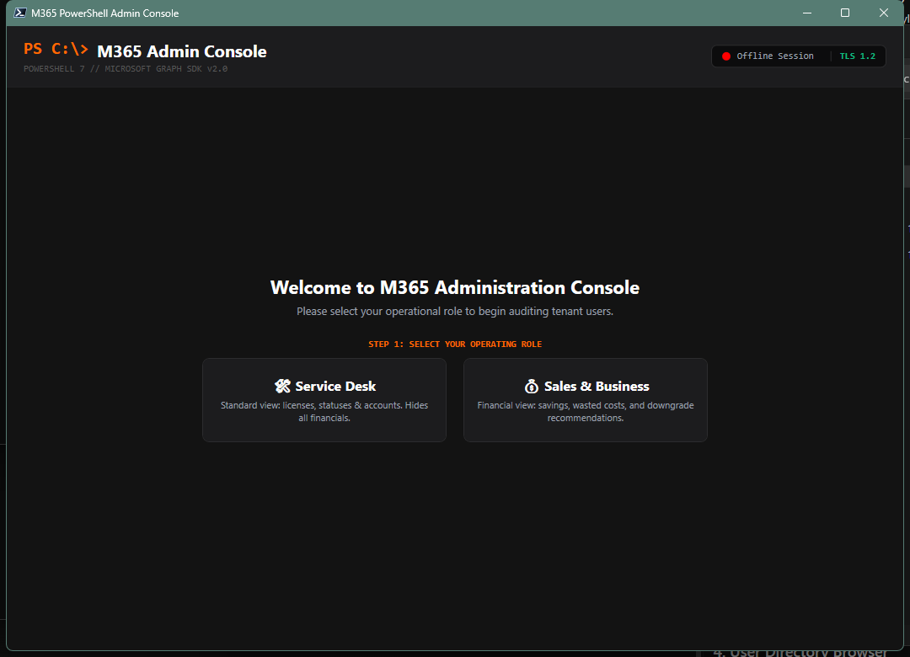
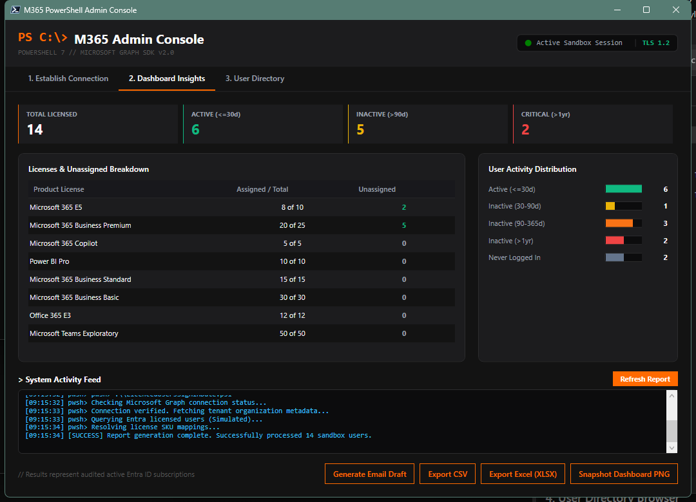
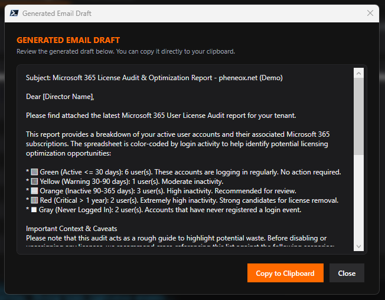
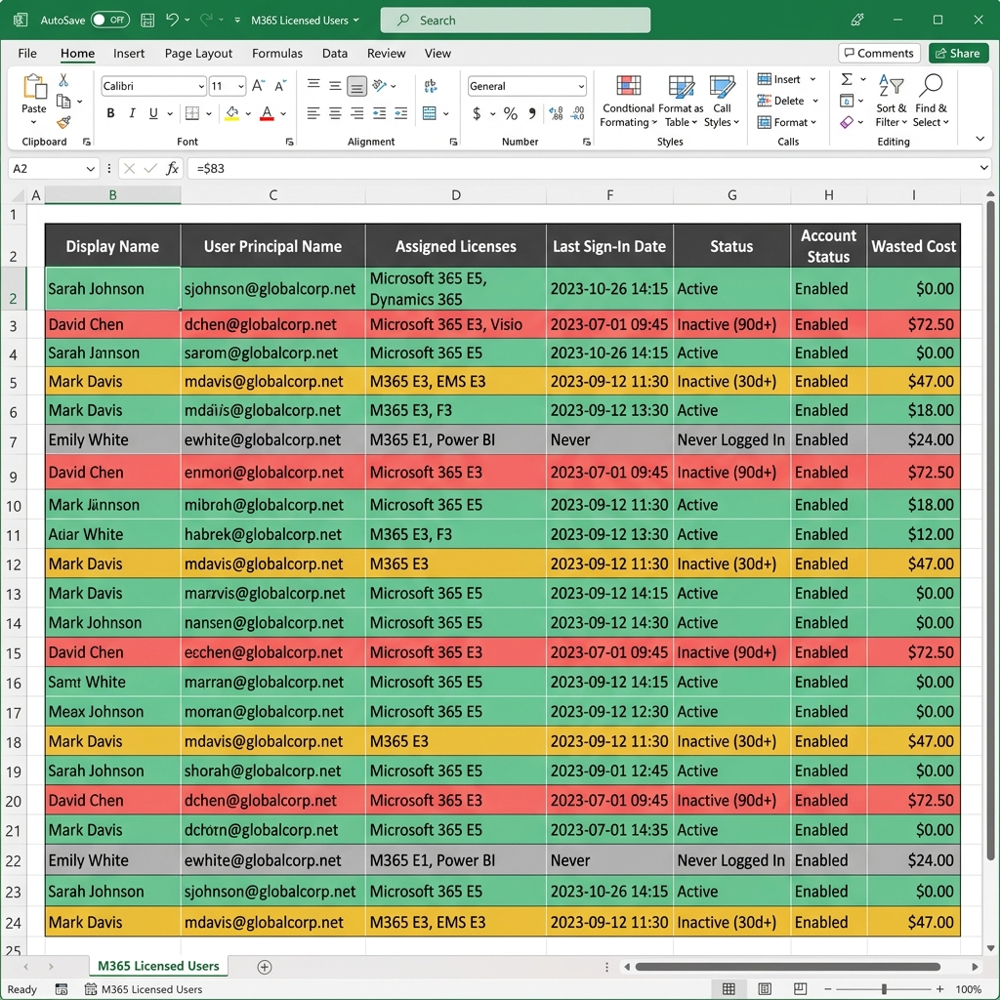
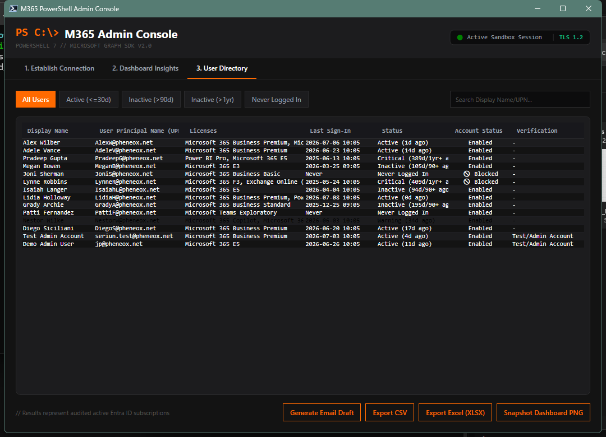

# User License Check Guide

## Overview
The `Console.ps1` script launches a modern, dark-themed (Kinetic Command) administration dashboard. It queries Microsoft Graph to fetch all licensed tenant users, dynamically resolves product subscription identifiers (SKU IDs), calculates inactive user periods, and provides tools to search, filter, and export data directly from your desktop.

### Key Features
* **ActiveSync Status Inspection:** Retrieves all mobile devices associated with a mailbox, showing Device Model, OS, Client Type, Access State, and Quarantine reason.
* **Cost Savings Analysis:** Dynamically calculates accumulated wasted license spend and projects recurring monthly savings for inactive accounts.
* **Interactive Visualization:** Displays interactive charts showing license distributions and user inactivity timelines, along with a live telemetry execution log.
* **Advanced Exclusion Filter:** Prompts to filter/exclude Seriun or JP verification accounts during report export.

> [!NOTE]
> **Log File Location:** `C:\Logs\UserLicenceCheck\LicensedUsers_RunLog_DDMMYY.log` (or `%SystemDrive%\Logs\UserLicenceCheck\LicensedUsers_RunLog_DDMMYY.log`)

## Prerequisites
OS Support: Windows 10 / 11 (due to WPF graphical requirements)
PowerShell: PowerShell 7.2 or later (Windows PowerShell 5.1 is not supported)
Permissions: Entra ID reader/admin role context (Global Reader, Global Administrator, Security Reader, or Reports Reader). No local Windows administrative rights are required to run the script or GUI dashboard.
Dependencies: `Microsoft.Graph` module (will auto-install if missing), `ImportExcel` module (for Excel reports; checks and prompts for permission to install on-demand).

## Walkthrough & Usage Guide

### 1. Launching the Console GUI
For best performance and to guarantee that the WPF graphics engine loads properly, use the batch launcher.
* **Option A (Recommended):** Double-click the `LaunchConsole.bat` helper script. It forces PowerShell 7 to initialize in STA (Single-Threaded Apartment) mode, which is required for WPF graphics.
* **Option B (Manual):** Run the following command from PowerShell 7:
  ```powershell
  pwsh.exe -NoProfile -ExecutionPolicy Bypass -File .\Console.ps1
  ```

### 2. Connection & Session Setup
When the console first opens, select your administrative profile. The layout changes dynamically based on the role to display or hide sensitive financial columns.



#### Steps to Connect:
1. **Choose Role:** Select **Service Desk** (license audits) or **Sales & Business** (cost-saving metrics).
2. **Select Connection:**
   * **Interactive Sign-In:** Authenticates your active administrative account via Entra ID OAuth (supports MFA/SSO).
   * **App Client Secret:** Connects using an Entra ID App Registration Client ID and Secret key.
   * **Offline CSV Import:** Loads a local audit report (`.csv`) to review offline.
   * **Demo Sandbox Mode:** Click the link at the bottom to test with mock database metrics offline.

### 3. Dashboard Insights
Once a connection is established, the console pulls live Microsoft Graph data and opens the main insights pane.



#### Key Panels:
* **KPI Metrics Row:** Displays totals for licensed users, active users, inactive (>90d) users, critical inactive (>1yr) users, and estimated monthly cost savings.
* **License Breakdown Grid:** Shows active licenses, assigned units, unassigned pool units, and monthly wasted budget per SKU.
* **System Activity Feed:** A monospace logging console detailing the underlying Microsoft Graph calls and query telemetry in real time.

### 4. Email Draft & Report Exporters
The console features multiple report exporters at the bottom of the dashboard. Selecting these compiles the audit into various formats.

#### Email Draft Generation
Clicking **Generate Email Draft** opens a dedicated modal window displaying a pre-formatted email report with color-coded bullet points, key metrics, and context explanations ready to be copied directly to your clipboard.



#### Excel Spreadsheet Export (.xlsx)
Clicking **Export Excel** generates a styled, multi-worksheet spreadsheet. The primary sheet highlights user rows using the same activity color schemes as the console directory for easy scanning. A secondary sheet details the unassigned license breakdown.



### 5. User Directory Browser
To inspect specific user accounts, select the **User Directory** tab from the top navigation bar.



#### Navigation Options:
1. **Filter Categories:** Quickly filter the directory by **Active (<=30d)**, **Inactive (>90d)**, **Inactive (>1yr)**, or **Never Logged In** buttons.
2. **Search Box:** Type display names or UPNs to filter the table instantly in memory.
3. **Audit Grid:** Highlights rows with distinct colors (green for active, orange for warnings, red for critical) to provide instant visual context.
