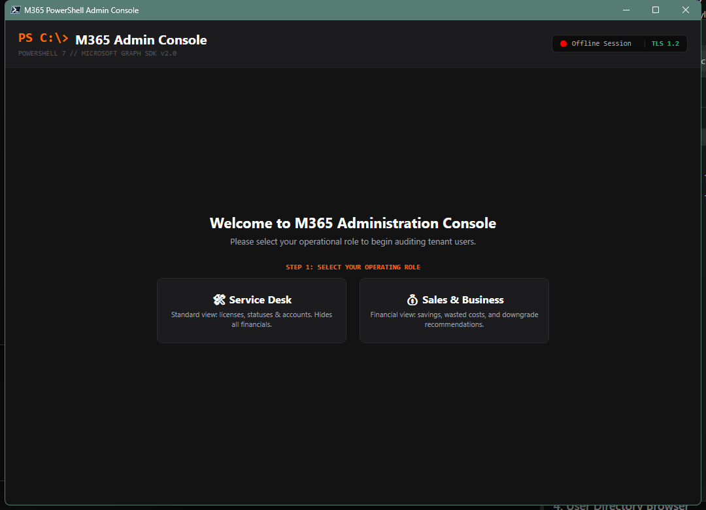
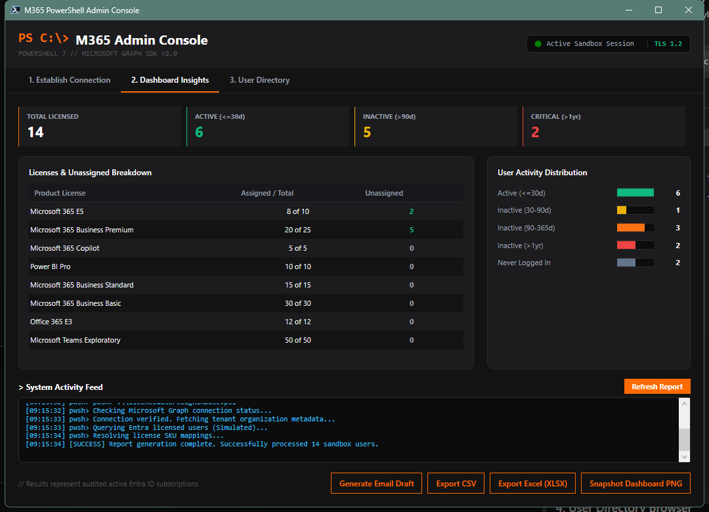
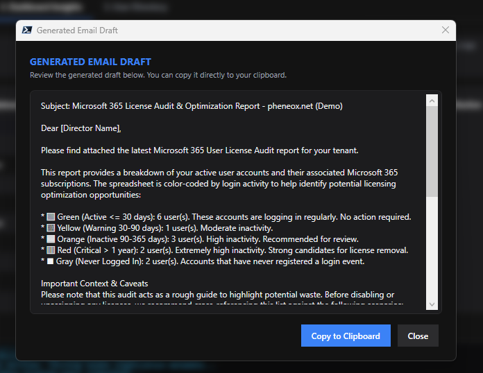
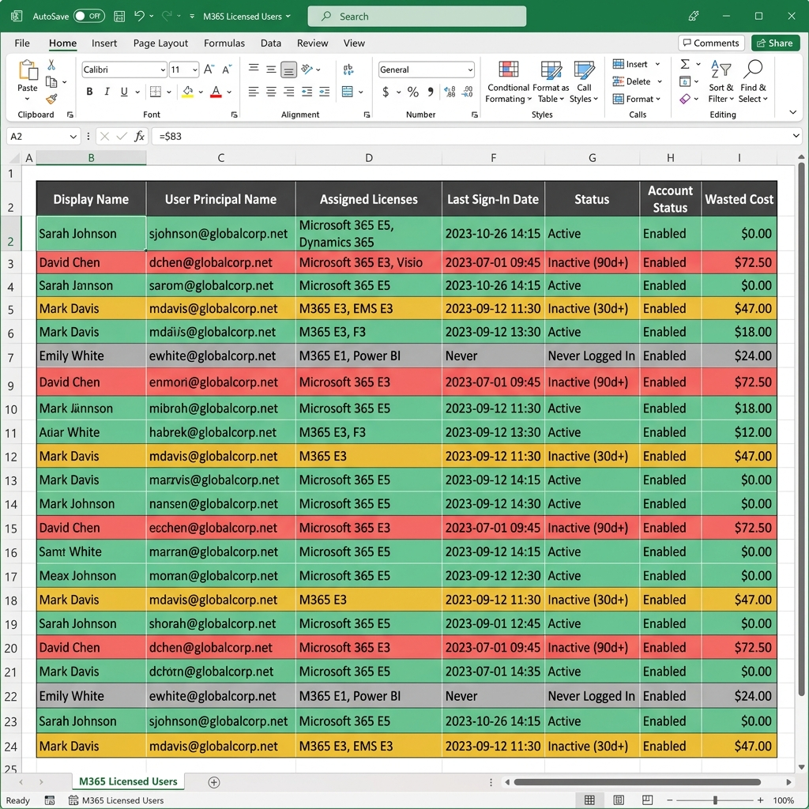
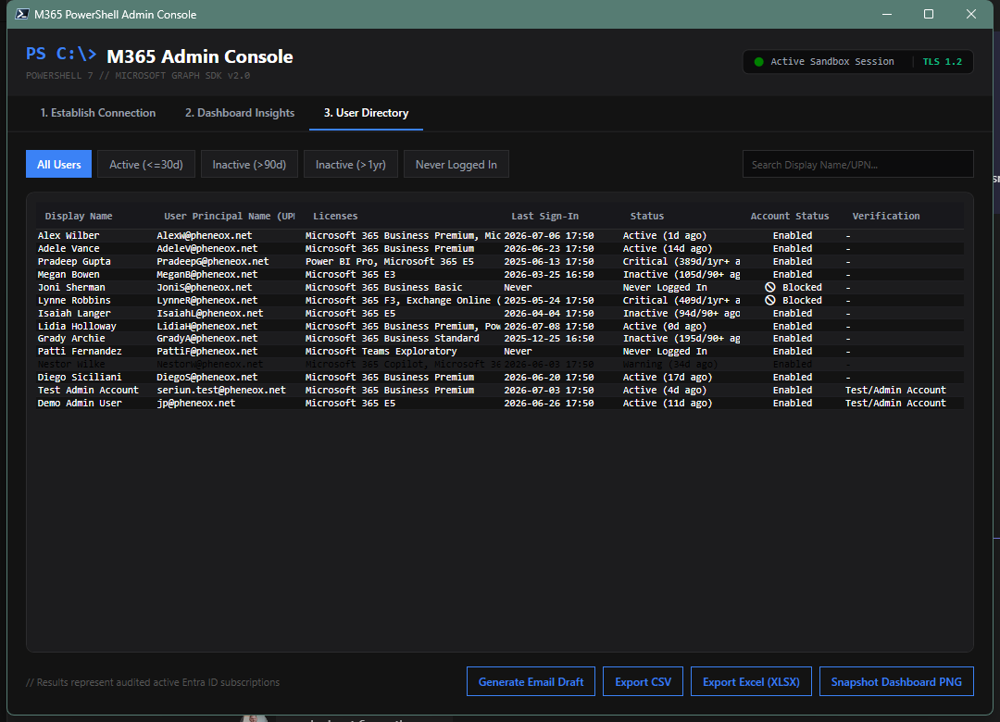

# User License Check Guide

## Overview
The `Console.ps1` script launches a modern, dark-themed (Kinetic Command) administration dashboard. It queries Microsoft Graph to fetch **all tenant users** (licensed and unlicensed, members and external guests, enabled and disabled accounts), extracts last sign-in telemetry, maps subscription identifiers (SKU IDs), and provides dynamic multi-filter controls and exporters directly from your desktop.

### Key Features
* **Full Tenant Directory Auditing:** Discovers every directory object—including unlicensed shared/service mailboxes, disabled accounts retaining paid licenses, and external partner guests.
* **Instant Filter Presets & Multi-Filtering:** Switch between one-click presets (e.g. *Active <=30d*, *Licensed + Guests*, *Unlicensed*, *Disabled*, *Guests Only*) or combine additive filters for License, Type, Account Status, and Activity.
* **Dynamic Global SKU Discovery & Self-Healing:** Resolves subscriptions against 2,900+ official Microsoft cloud products, tenant-subscribed part numbers, and service plans, properly mapping self-service free tiers (such as Microsoft Fabric Free / Power BI Free at £0.00) without false Power BI Pro alarms.
* **ActiveSync Status Inspection:** Retrieves all mobile devices associated with a mailbox, showing Device Model, OS, Client Type, Access State, and Quarantine reason.
* **Cost Savings & Waste Reclamation:** Flags inactive accounts and highlights disabled users still holding active paid licenses with automated monthly savings projections.
* **Interactive Visualization:** Displays interactive charts showing license distributions and user inactivity timelines, along with a live telemetry execution log.
* **Advanced Exclusion Filter:** Prompts to filter/exclude test or admin verification accounts during report export.
* **Automated CLI Filtering:** `LicencedUsersSigninDate.ps1` supports the `-Filter` parameter (`All`, `Active`, `Licensed`, `LicensedAndGuests`, `Guests`, `Unlicensed`, `Disabled`, `Inactive90d`, `Never`) for headless automation.

> [!NOTE]
> **Log File Location:** `C:\Logs\UserLicenceCheck\LicensedUsers_RunLog_DDMMYY.log` (or `%SystemDrive%\Logs\UserLicenceCheck\LicensedUsers_RunLog_DDMMYY.log`)

## Prerequisites
OS Support: Windows 10 / 11 (due to WPF graphical requirements)
PowerShell: PowerShell 7.2 or later (Windows PowerShell 5.1 is not supported)
Permissions: Entra ID reader/admin role context (Global Reader, Global Administrator, Security Reader, or Reports Reader). No local Windows administrative rights are required to run the script or GUI dashboard.
Licensing (Last Sign-In Telemetry): Microsoft Entra ID P1 or P2 license (included with Microsoft 365 Business Premium, Enterprise E3/E5, or standalone Entra ID P1/P2).
- *Non-Premium Tenant Behavior:* If the tenant lacks Entra ID P1/P2 licensing, Microsoft Graph restricts `SignInActivity` date access. The tool gracefully detects this and runs the complete license audit, cost analysis, and report exporter without sign-in timestamps (displaying *"Requires Entra ID P1/P2"*).
Dependencies: `Microsoft.Graph` module (will auto-install if missing), `ImportExcel` module (for Excel reports; checks and prompts for permission to install on-demand).

## Walkthrough & Usage Guide

### 1. Launching the Console GUI
For best performance and to guarantee that the WPF graphics engine loads properly, use the batch launcher.
* **Option A (Recommended):** Double-click the `LaunchConsole.bat` helper script. It forces PowerShell 7 to initialize in STA (Single-Threaded Apartment) mode, which is required for WPF graphics.
* **Option B (Manual):** Run the following command from PowerShell 7:
  ```powershell
  pwsh.exe -NoProfile -ExecutionPolicy Bypass -File .\Console.ps1
  ```

### 2. Connection & Session Setup
When the console first opens, select your administrative profile. The layout changes dynamically based on the role to display or hide sensitive financial columns.



#### Steps to Connect:
1. **Choose Role:** Select **Service Desk** (license audits) or **Sales & Business** (cost-saving metrics).
2. **Select Connection:**
   * **Interactive Sign-In:** Authenticates your active administrative account via Entra ID OAuth (supports MFA/SSO).
   * **App Client Secret:** Connects using an Entra ID App Registration Client ID and Secret key.
   * **Offline CSV Import:** Loads a local audit report (`.csv`) to review offline.
   * **Demo Sandbox Mode:** Click the link at the bottom to test with mock database metrics offline.

### 3. Dashboard Insights
Once a connection is established, the console pulls live Microsoft Graph data and opens the main insights pane.



#### Key Panels:
* **KPI Metrics Row:** Displays totals for licensed users, active users, inactive (>90d) users, critical inactive (>1yr) users, and estimated monthly cost savings.
* **License Breakdown Grid:** Shows active licenses, assigned units, unassigned pool units, and monthly wasted budget per SKU.
* **System Activity Feed:** A monospace logging console detailing the underlying Microsoft Graph calls and query telemetry in real time.

### 4. Email Draft & Report Exporters
The console features multiple report exporters at the bottom of the dashboard. Selecting these compiles the audit into various formats.

#### Email Draft Generation
Clicking **Generate Email Draft** opens a dedicated modal window displaying a pre-formatted email report with color-coded bullet points, key metrics, and context explanations ready to be copied directly to your clipboard.



#### Excel Spreadsheet Export (.xlsx)
Clicking **Export Excel** generates a styled, multi-worksheet spreadsheet. The primary sheet highlights user rows using the same activity color schemes as the console directory for easy scanning. A secondary sheet details the unassigned license breakdown.



### 5. User Directory Browser
To inspect specific user accounts, select the **User Directory** tab from the top navigation bar.



#### Navigation & Filtering Options:
1. **Quick Presets (Top Row):** Instantly isolate common working sets:
   - **All Users:** Full directory overview.
   - **Active (<=30d):** Users with recent interactive sign-in activity.
   - **Lic + Guests:** Combines all licensed accounts with all external guest users.
   - **Licensed Only:** Accounts with one or more Microsoft 365 / Entra ID licenses.
   - **Guests Only:** External partner/guest accounts (`UserType: Guest` or `#EXT#` UPNs).
   - **Unlicensed:** Accounts with zero assigned licenses (shared mailboxes, room resources, unassigned accounts).
   - **Disabled Accounts:** Blocked/disabled directory accounts, highlighting any with lingering paid licenses.
   - **Inactive (90d+) & Never:** High-priority candidates for license reclamation.
2. **Additive Multi-Filter Toolbar (Second Row):** Fine-tune results by combining sub-filters:
   - **License:** All / Licensed / Unlicensed
   - **User Type:** All / Members / Guests / Lic + Guests
   - **Account Status:** All / Enabled / Disabled
   - **Activity:** All / Active / Inactive 90d+ / Never
   - **Reset Filters:** Restores full directory view.
3. **Search Box & Live Counter:** Type display names, UPNs, user types, or license names to filter in real time. The live counter reports matching counts (e.g. `Showing 18 of 21 users`).
4. **Audit Grid:** Highlights interactive sign-in freshness (green for active, orange for warnings, red for critical, purple for missing P1/P2) and renders external guests with cyan badges (`#06b6d4`).

## Fast Execute
> [!TIP]
> **Run Packaged Bundle Locally in PowerShell:**
> Because this console relies on local relative files (`LicensePrices.csv`, `LicencedUsersSigninDate.ps1`), download and extract the package folder, then execute locally (or use `LaunchConsole.bat`):
> ```powershell
> powershell.exe -ExecutionPolicy Bypass -File .\Console.ps1
> ```
